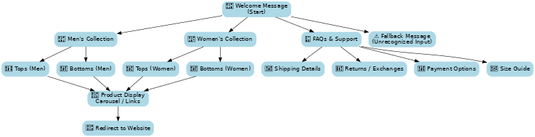

# Chatbot Design by ChatFuel, Facebook Business Page Creation
*Wear Your Freedom – Automated E-Commerce Assistant*

## 📌 Project Overview  
This project demonstrates the design and implementation of a fully automated **Facebook Messenger chatbot** for **Allez Attire**, a fictional fashion brand offering men’s and women’s clothing, for which a facebook page had been created.

 

The chatbot was built using **ChatFuel**, connected to a **Facebook Business Page**, and synchronized to provide instant customer service, FAQs, and guided shopping flows, all without human intervention.  

🔗 **Live Chatbot Link**: [m.me/102326442217595](https://m.me/102326442217595)

Please view some of the **Snapshots** of Interactions with the Chatbot.

---

## 🎯 Key Objectives  
- Enhance online shopping by providing **instant responses**.  
- Redirect customers to Allez Attire’s **website & product collections**.  
- Address **FAQs** (shipping, returns, sizing, payments).  
- Reduce friction in the buying process.  
- Reinforce brand identity: **“Wear Your Freedom.”**  

---

## 🛠️ Features  
- **Structured Navigation** – Men’s / Women’s collections, FAQs, Returns.  
- **Category Exploration** – Tops, bottoms, best sellers.  
- **FAQ Support** – Sizes, payments, shipping, returns.  
- **Fallback Handling** – Friendly messages for unrecognized queries.  
- **Engagement** – Conversational tone with visuals.  

---

## 📊 Workflow Design  

  

The chatbot flow was designed to ensure:  
- **Straightforward Navigation** (quick start with main categories).  
- **Tailored Shopping** (separate men’s/women’s product paths).  
- **Customer Query Anticipation** (common e-commerce FAQs).  
- **Positive Fallback** (always guides users forward).  
- **Brand Engagement** (consistent tone and visual reinforcement).  

---

## ⚠️ Shortcomings  
- Limited personalization (no AI-driven recommendations yet).  
- No real-time inventory sync.  
- Static responses only.  
- English-only support.  

---

## 🚀 Future Enhancements  
- Integrate **machine learning** for personalized product suggestions.  
- Link chatbot to **live inventory & pricing updates**.  
- Add **multilingual support** for global reach.  
- Expand FAQ library based on customer interactions.  
- Seasonal campaigns and promotions integration.  

---

## 📚 Development Guidance  
If a new team member continues this project, they should:  
1. Review the current flow structure.  
2. Implement real-time features (inventory, pricing).  
3. Enhance personalization with AI.  
4. Add translations for multilingual use.  
5. Test and optimize via A/B testing and analytics.  

---

## 📄 Documentation  
The detailed project report can be found here:  
👉 [Chatbot Project Report](docs/chatbot_report.pdf)  

---

## 🏷️ Project Metadata  
- **Business/Page Name**: Allez Attire  
- **Category**: Men’s & Women’s Clothing  
- **Tools Used**: ChatFuel, Facebook Business Page, Messenger API  
- **Tagline**: *Wear Your Freedom*  
